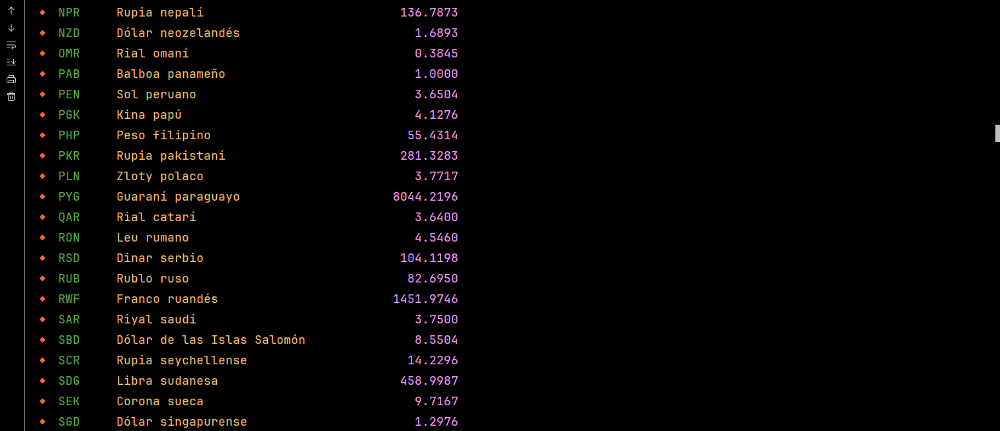
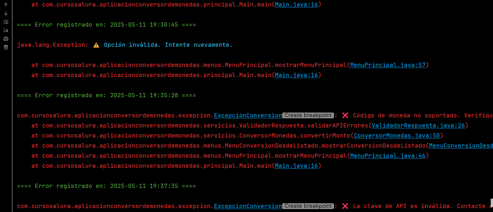
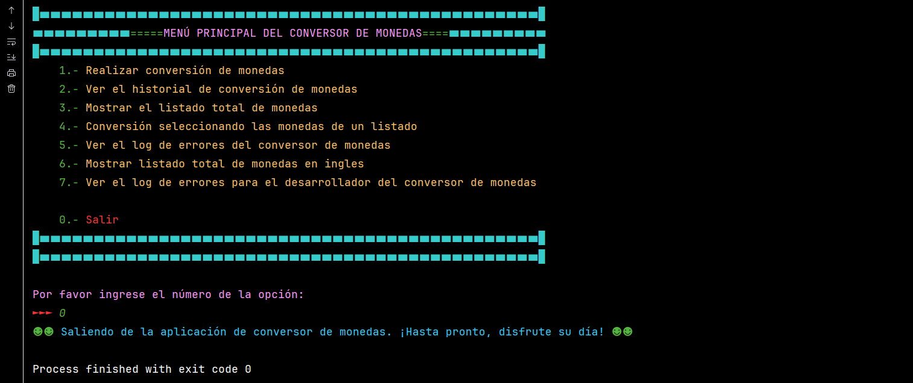

***
# <h1 align="center"> 💥Challenge Conversor de Monedas consumiendo ExchangeRate-API💥 </h1>
***


## 📄Descripción del proyecto

```sh

La Aplicación Conversor de Monedas es un sistema desarrollado en Java con enfoque educativo y práctico, 
que permite a los usuarios realizar conversiones de divisas en tiempo real mediante el consumo de una 
API externa de tasas de cambio [ExchangeRate-API]. El proyecto está diseñado bajo los principios de 
programación orientada a objetos, separación de responsabilidades y modularidad, facilitando su 
mantenimiento y expansión futura.

```

## 📃Objetivos de aprendizaje

```sh

- Aplicar conceptos de POO, manejo de excepciones, entrada/salida de archivos y consumo de APIs REST.
- Brindar una base extensible para aplicaciones educativas.
- Demostrar buenas prácticas de diseño, encapsulamiento, abstracción y reutilización de código.

```

## 🛠️Recursos y herramientas utilizados

```sh

- Trello: para organizar las tareas y el progreso del proyecto.
- Discord: para comunicarse con los compañeros y aclarar dudas.
- Cursos y formaciones de Alura Latam: para consultar contenidos relevantes y obtener más información.
- GitHub: para publicar y compartir el código del proyecto.
- LinkedIn: para conectarse con la comunidad y mostrar el aprendizaje adquirido.

```

## 📗Funcionalidad del Conversor de Monedas

```sh

1. Configuración de la clave API (api.key): Para que el conversor funcione correctamente, es necesario 
   contar con una clave de acceso (API Key) del servicio externo [ExchangeRate-API], la puedes conseguir
   en esta dirección: https://www.exchangerate-api.com/
      - Esta clave debe colocarse dentro del archivo config.properties, ubicado en la raíz de la carpeta 
        src del proyecto.
      - Formato del archivo: api.key=TU_CLAVE_AQUI
      - La clase Configuracion se encarga de leer esta clave automáticamente desde el archivo, y lanza 
        errores si está vacía o no se encuentra.

2. Ingreso de datos por el usuario: A través del menú interactivo, el usuario puede
      - Ingresar el código de la moneda base (por ejemplo, USD).
      - Ingresar el código de la moneda destino (por ejemplo, EUR).
      - Ingresar el monto a convertir (por ejemplo, 100.0).

3. Validación de entrada: Antes de realizar la conversión, el sistema valida
      - Que los códigos de moneda existan, que sean letras, pueden ser en mayúsculas o minusculas, no números.
      - Que el monto ingresado sea un número positivo.
      - Que los campos no estén vacíos. Esto lo realiza la clase ValidacionEntrada

4. Consulta de tasas de conversión en tiempo real: El conversor se conecta en tiempo real al API de tipo 
   de cambio utilizando la clave API para:
   - Obtener la tasa actual de conversión.
   - Calcular el resultado del monto convertido.
   - Recibir respuestas estructuradas como RespuestaConversionMonto.

5. Presentación del resultado al usuario: La aplicación muestra
      - El monto original y la moneda de origen.
      - La moneda de destino y la tasa de conversión.
      - El resultado final del monto convertido.

6. Registro de historial de conversiones: Cada conversión exitosa se guarda automáticamente en un archivo 
   llamado historial_conversiones.txt para consulta futura.

7. Manejo de errores de API y del sistema: Si ocurre un error (como clave inválida, código de moneda 
   incorrecto, API caída, etc.)
   - Se registra un mensaje amigable en log_errores.txt.
   - Se guarda un registro técnico con traza detallada en log_errores_desarrollador.txt.

8. Conversión desde listado de monedas (opcional): En lugar de escribir los códigos manualmente, el usuario 
   puede
   - Ver un listado de monedas disponibles.
   - Seleccionar desde ese listado para evitar errores de escritura.

```
## 📑Características

- 🔄 Conversión de monedas: Convierte un monto entre dos monedas utilizando tasas de cambio obtenidas 
      de una API (ExchangeRate API).

- 📋 Listado completo de monedas: Muestra al usuario una lista de monedas disponibles en español e ingles
      con sus respectivos códigos y tasas.

- 🧾 Historial de conversiones: Registra cada operación realizada en un archivo historial_conversiones.txt 
      para futuras consultas.

- ⚠️ Manejo y registro de errores: Implementa una estructura robusta para capturar errores funcionales
      (como los errores que maneja la API) y técnicos (excepciones), almacenándolos en 
      archivos separados.

- 👨‍💻 Log para desarrolladores: Incluye un log detallado con trazas de errores para facilitar la depuración.

- 📂 Configuración externa: Usa un archivo config.properties para almacenar la clave de acceso a la API, 
      facilitando cambios sin recompilar.

- 🔐 Validación de entradas: Verifica que los datos ingresados por el usuario sean válidos antes de procesarlos.

- 📚 Interfaz de usuario por consola: Menú interactivo con navegación clara para realizar operaciones de forma 
      sencilla.

## 🧱Tecnologías Utilizadas

✔️☕ Oracle Java OpenJDK 21.0.6

✔️🛠️ IntelliJ IDEA 2025 1.1.1

✔️🌐 ExchangeRate API

✔️📦 Gson (para deserialización de JSON gson-2.13.1.jar)

✔️📁 Archivos planos (para almacenamiento de historial y logs)

✔️✅ Estructura de carpetas orientada a paquetes lógicos: modelos, servicios, menús, utilidades y errores.

## 🧭Arquitectura y diseño

- Uso de interfaces y records para modelar respuestas de la API.

- Separación de lógica en capas:

   - config: Este paquete maneja la configuración externa de la aplicación. Contiene la clase Configuracion, que:

      - Carga automáticamente el archivo config.properties desde el classpath.

      - Valida que la clave api.key esté presente y correctamente configurada.

      - Registra errores si el archivo o la clave faltan.

      - Expone un método obtener(String clave) para recuperar cualquier propiedad cargada.

   - presentacion: presentación principal del conversor de monedas

   - principal: contiene la clase Main, punto de entrada de la aplicación, que orquesta los menús y operaciones.

   - menus: gestiona la interacción con el usuario a través de un menú de consola dividido por funcionalidades.

   - servicios: contiene la lógica, incluyendo el consumo de la API de tipos de cambio, y la realización de conversiones.

   - modelos: agrupa las estructuras de datos que representan las respuestas de la API (records) y las solicitudes de conversión.

   - excepcion: manejo de errores

   - historial: define clases para manejar y registrar errores funcionales y técnicos, diferenciando entre mensajes para el usuario y  
                detalles para desarrolladores y el historico de conversiones.

   - utilidades: valida datos ingresados por el usuario.

- Manejo estructurado de errores y excepciones específicas de dominio.

## 🙏Contribuciones

>> Si deseas contribuir al proyecto, siéntete libre de hacer un fork del repositorio y enviar un pull request con tus mejoras o sugerencias.

## 🔆Resultados del Conversor de Monedas

>> 

>> 

>> 

>> 

>> 

>> 

>> 

>> 

>> 

>> 

>> 

>> 

>> 

>> 

>> 

>> 

>> 

>> 

>> 

>> 

>> 

>> 

>> 

>> 

>> 

>> 

>> 

>> 

>> 

>> 

>> 

>> 

>> 

>> 

>> 

>> 

>> 

>> 

## 👩👨Autores del Proyecto

>>     Programación Java POO, diagrama UML
>                               
>>>   Desafio puesto

## 🏆Insignias ganadas

>>     Segunda insignia ganada

## 📜Certificado

